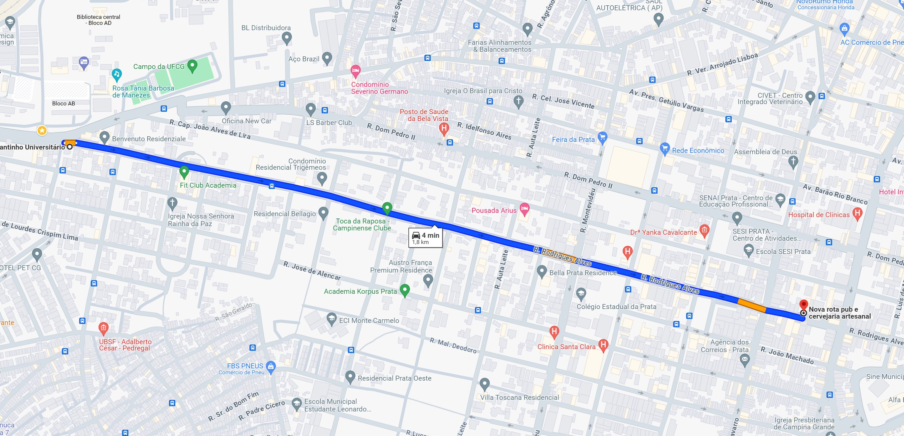
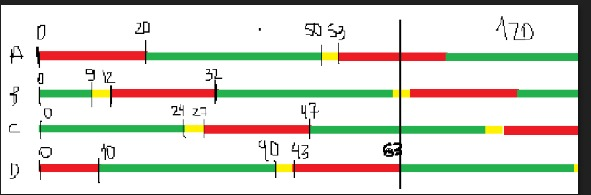
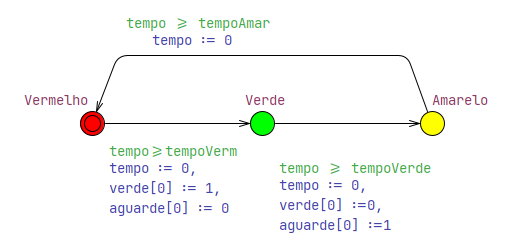
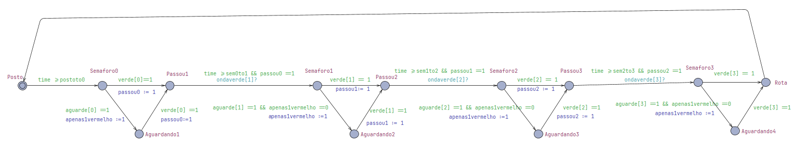

# Elaboração de uma Onda Verde

## Objetivo

Para percorrer um determinado trajeto, um motorista precisa passar por 4 semáforos que usualmente não estão sincronizados.<br />
O objetivo deste projeto é modelar usando o UPPAAL um sistema de semáforos que permita ao motorista chegar ao destino parando em no máximo um semáforo. Ou seja, criar **modelos de autômatos temporizados** que definem o comportamento da via e do semáforo. 



## Dados do problema

- Distância do posto ao 1º semáforo: 1.200m
- Distância do 1º ao 2º semáforo: 130m
- Distância do 2º ao 3º semáforo: 160m
- Distância do 3º ao 4º semáforo: 170m
- Distância do 4º semáforo ao Rota: 90m
- Distância total: 1.750m
- Velocidade média de deslocamento: 40 km/h

## Considerações

Considerou-se a passagem de apenas um carro. <br />
Para o semáforo, estabelecemos um tempo de ciclo de 53 segundos em que: <br />

- Tempo do Verde = 30 segundos
- Tempo do Vermelho = 20 segundos
- Tempo do Amarelo = 3 segundos

O funcionamento dos Semáforos deve seguir a temporização do diagrama abaixo:



## Estrutura e Modelagem dos Automatos

Temos duas estruturas básicas criadas para o funcionamento da onda verde:

- Semáforo </br>


O modelo do Semáforo funciona de modo semelhante a um semáforo real com mudanças cronometradas de vermelho para verde, de verde para amarelo e de amarelo para vermelho. </br>

- Via </br>


O modelo da Via representa a liberação ou aguardo da via como um todo a partir do funcionamento do semáforo, logo, todos os veículos que estão naquela determinada via durante o sinal verde estão liberados para passar para as proximas vias adiantes, ou aguardar enquanto o sinal daquela via está no vermelho.  

No nosso caso, a via só pode aguardar durante um sinal vermelho apenas uma vez para que ocorra o sucesso da nossa onda verde. Garantimos isso quando obrigamos o motorista a "acelerar o veículo" para pegar o proximo sinal verde, ou seja, caso ele tenha pego um sinal vermelho, nossa varáivel `apenas1vermelho` recebe o valor de 1, enquanto não, continua com o valor igual 0. 

## Declaração das Variáveis do Projeto

```
const int n = 4;

// Tempo de ciclo 53 segundos. 30 verde, 3 amarelo, 20 vermelho

const int tempoVerm = 20;
const int tempoVerde = 30;
const int tempoAmar = 3;

int postoto0 = 108; // 1200 metros a 40km/h = 108segundos
int sem0to1 = 120; // 130 metros a 40km/h aproximadamente 12segundos
int sem1to2 = 135; // 160 metros a 40km/h aproximadament 15segundos
int sem2to3 = 151; // 170 metros a 40km/h aproximadamente 16segundos

chan ondaverde[n];
clock time; // Relógio Geral

int passou0 = 0, passou1 = 0, passou2 = 0, apenas1vermelho = 0;
int verde[n];
int aguarde[n] = {1,1,1,1};
```

## Verificação das Propriedades

As seguintes propriedades foram satisfeitas:

```
A[] not deadlock
```
```
E<> (Semaforo0.Verde imply Semaforo1.Verde) && (Semaforo1.Verde imply Semaforo2.Verde) && (Semaforo2.Verde imply Semaforo3.Verde)
```

## Simulação

Para simular o projeto, basta utilizar o arquivo `onda-verde.xml` junto com o software **UPPAAL**.  

Para acessar a documentação do software basta acessar o [link](https://docs.uppaal.org/)

## 📺Vídeo de Demonstração

[](https://youtu.be/zFAvdG2gaKU)


## ✒️ Colaboradores
* **Bruno Nascimento de Oliveira** - [BRUNONASCIOLI](https://github.com/BRUNONASCIOLI)
* **José Tayrone Santos de Oliveira** - [thayroneo](https://github.com/thayroneo)
* **Yuri Siqueira Dantas** - [YuriDants](https://github.com/YuriDants)

Você também pode ver a lista de todos os [colaboradores](https://github.com/BRUNONASCIOLI/Projeto_STR/colaboradores) que participaram deste projeto.
